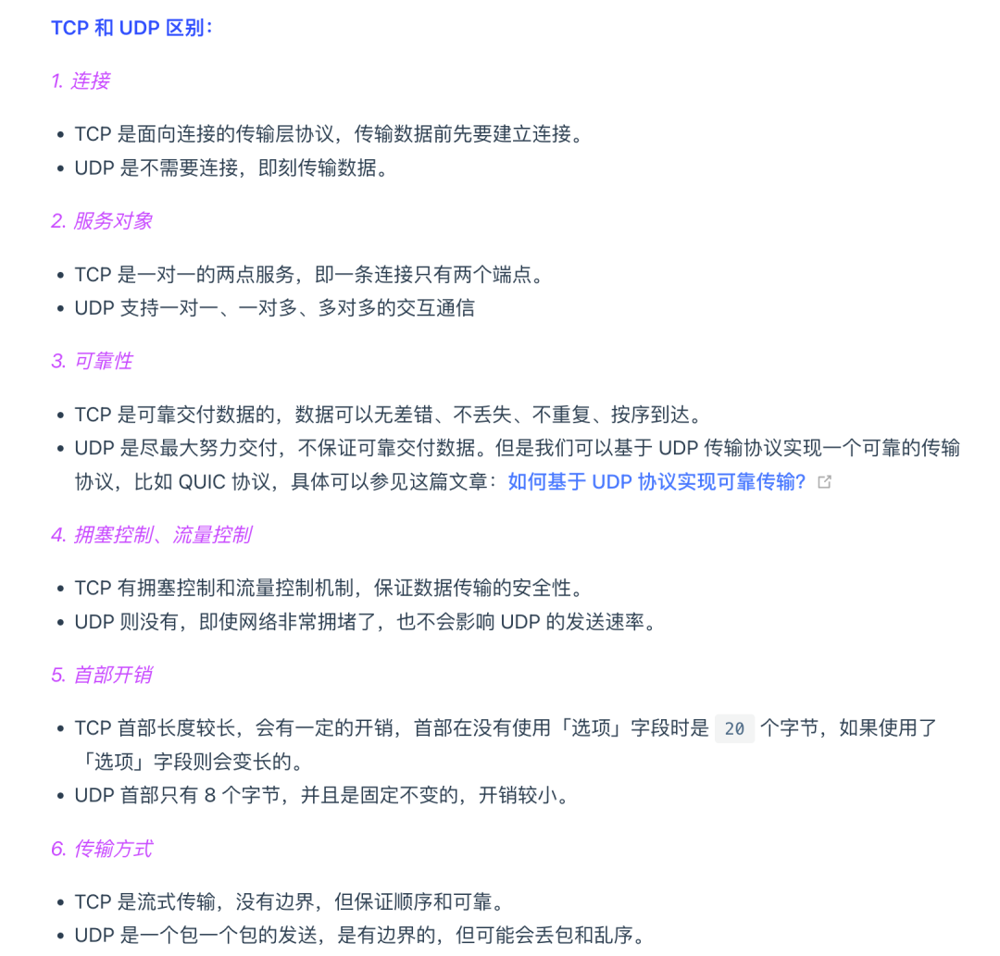

- Network 
  - TCP vs UDP
    - 
  - 流量控制机制 
    - 由接收方控制的、调节发送方生产速度的机制. 
    - 接收能力的变化导致窗口大小的变化，即TCP 流量控制机制
  - 拥塞控制
    - 发送能力的变化导致窗口大小的变化，即 TCP 拥塞控制机制。
    - TCP 不能忽略网络上发生的事，它被设计成一个无私的协议，当网络发送拥塞时，TCP 会自我牺牲，降低发送的数据量。于是，就有了拥塞控制
  - select、poll、epoll区别
    - select
      - select 实现多路复用的方式是，将已连接的 Socket 都放到一个文件描述符集合，然后调用 select 函数将文件描述符集合拷贝到内核里，让内核来检查是否有网络事件产生，检查的方式很粗暴，就是通过遍历文件描述符集合的方式，当检查到有事件产生后，将此 Socket 标记为可读或可写， 接着再把整个文件描述符集合拷贝回用户态里，然后用户态还需要再通过遍历的方法找到可读或可写的 Socket，然后再对其处理。
      - 对于 select 这种方式，需要进行 2 次「遍历」文件描述符集合，一次是在内核态里，一个次是在用户态里 ，而且还会发生 2 次「拷贝」文件描述符集合，先从用户空间传入内核空间，由内核修改后，再传出到用户空间中。
      - select 使用固定长度的 BitsMap，表示文件描述符集合，而且所支持的文件描述符的个数是有限制的，在 Linux 系统中，由内核中的 FD_SETSIZE 限制， 默认最大值为 1024，只能监听 0~1023 的文件描述符。
    - poll
      - poll 不再用 BitsMap 来存储所关注的文件描述符，取而代之用动态数组，以链表形式来组织，突破了 select 的文件描述符个数限制，当然还会受到系统文件描述符限制。
      - poll 和 select 并没有太大的本质区别，都是使用「线性结构」存储进程关注的 Socket 集合，因此都需要遍历文件描述符集合来找到可读或可写的 Socket，时间复杂度为 O(n)，而且也需要在用户态与内核态之间拷贝文件描述符集合
    - epoll
      - epoll 在内核里使用「红黑树」来关注进程所有待检测的 Socket，红黑树是个高效的数据结构，增删改一般时间复杂度是 O(logn)，通过对这棵黑红树的管理，不需要像 select/poll 在每次操作时都传入整个 Socket 集合，减少了内核和用户空间大量的数据拷贝和内存分配。
      - epoll 使用事件驱动的机制，内核里维护了一个「链表」来记录就绪事件，只将有事件发生的 Socket 集合传递给应用程序，不需要像 select/poll 那样轮询扫描整个集合（包含有和无事件的 Socket ），大大提高了检测的效率。
  - 零拷贝
    - sendfile 系统调用实现了零拷贝技术，零拷贝技术的文件传输方式相比传统文件传输的方式，减少了 2 次上下文切换和数据拷贝次数，只需要 2 次上下文切换和数据拷贝次数，就可以完成文件的传输，而且 2 次的数据拷贝过程，都不需要通过 CPU，2 次都是由 DMA 来搬运，使用零拷贝的项目有nginx、kafka。
  - 既然 IP 层会分片，为什么 TCP 层还需要 MSS 呢？
    - MSL 与 TTL 的区别：MSL 的单位是时间，而 TTL 是经过路由跳数。所以 MSL 应该要大于等于 TTL 消耗为 0 的时间，以确保报文已被自然消亡。
    - 那么当如果一个 IP 分片丢失，整个 IP 报文的所有分片都得重传。 因为 IP 层本身没有超时重传机制，它由传输层的 TCP 来负责超时和重传。
    - 经过 TCP 层分片后，如果一个 TCP 分片丢失后，进行重发时也是以 MSS 为单位，而不用重传所有的分片，大大增加了重传的效率。
  - 序列号：
    - 在建立连接时由计算机生成的随机数作为其初始值，通过 SYN 包传给接收端主机，每发送一次数据，就「累加」一次该「数据字节数」的大小。
    - 用来解决网络包乱序问题
  - 确认应答号：
    - 指下一次「期望」收到的数据的序列号，发送端收到这个确认应答以后可以认为在这个序号以前的数据都已经被正常接收。
    - 用来解决不丢包的问题
  -  为什么需要 TIME_WAIT 状态？
    - 主动发起关闭连接的一方，才会有 TIME-WAIT 状态。需要 TIME-WAIT 状态，主要是两个原因：
      - 防止具有相同「四元组」的「旧」数据包被收到
      - 保证「被动关闭连接」的一方能被正确的关闭，即保证最后的 ACK 能让被动关闭方接收，从而帮助其正常关闭
    - TIME_WAIT 过多有什么危害？
      - 如果服务器有处于 TIME-WAIT 状态的 TCP，则说明是由服务器方主动发起的断开请求。过多的 TIME-WAIT 状态主要的危害有两种：
      - 第一是内存资源占用
      - 第二是对端口资源的占用，一个 TCP 连接至少消耗一个本地端口
  - 为什么是三次握手？不是两次、四次？
    - TCP建立连接时，通过三次握手
      - 能防止历史连接的建立
        - 客户端连续发送多次 SYN 建立连接的报文，在网络拥堵情况下：
          - 一个「旧 SYN 报文」比「最新的 SYN 」 报文早到达了服务端 那么此时服务端就会回一个 SYN + ACK 报文给客户端
          - 客户端收到后可以根据自身的上下文，判断这是一个历史连接（序列号过期或超时），那么客户端就会发送 RST 报文给服务端，表示中止这一次连接
      - 能减少双方不必要的资源开销，
        - 如果只有「两次握手」，当客户端的 SYN 请求连接在网络中阻塞，客户端没有接收到 ACK 报文，就会重新发送 SYN ，由于没有第三次握手，服务器不清楚客户端是否收到了自己发送的建立连接的 ACK 确认信号，所以每收到一个 SYN 就只能先主动建立一个连接，这会造成什么情况呢？如果客户端的 SYN 阻塞了，重复发送多次 SYN 报文，那么服务器在收到请求后就会建立多个冗余的无效链接，造成不必要的资源浪费。
      - 能帮助双方同步初始化序列号。 序列号能够保证数据包不重复、不丢弃和按序传
        - TCP 协议的通信双方， 都必须维护一个「序列号」， 序列号是可靠传输的一个关键因素，它的作用：
          - 接收方可以去除重复的数据
          - 接收方可以根据数据包的序列号按序接收
          - 可以标识发送出去的数据包中， 哪些是已经被对方收到的
    - 两次握手：无法防止历史连接的建立，会造成双方资源的浪费，也无法可靠的同步双方序列号
    - 四次握手：三次握手就已经理论上最少可靠连接建立，所以不需要使用更多的通信次数
  - TCP 优化
    - 三次握手
      - SYN重传次数 tcp_sync_retries
      - 绕过三次握手 tcp fastopen
    - 四次挥手
      - FIN重传次数  orphan retries
      - FIN WAIT2的时间（close调用） fin timeout
      - 孤儿链接的上限个数  max orphans
  - CDN
    - 本地 DNS 服务器去请求 CDN 的 GSLB 的域名，GSLB 就会为用户选择一台合适的 CDN 节点提供服务，选择的依据主要有以下几点：
      - 看用户的 IP 地址，查表得知地理位置，找相对最近的 CDN 节点；
      - 看用户所在的运营商网络，找相同网络的 CDN 节点；
      - 看用户请求 URL，判断哪一台服务器上有用户所请求的资源；
      - 查询 CDN 节点的负载情况，找负载较轻的节点；
  - 当服务端出现大量 CLOSE_WAIT 状态的连接的时候，说明服务端的程序没有调用 close 函数关闭连接
    - 我们先来分析一个普通的 TCP 服务端的流程：
      - 1 创建服务端 socket，bind 绑定端口、listen 监听端口
      - 2 将服务端 socket 注册到 epoll
      - 3 epoll_wait 等待连接到来，连接到来时，调用 accpet 获取已连接的 socket
      - 4 将已连接的 socket 注册到 epoll
      - 5 epoll_wait 等待事件发生
      - 6 对方连接关闭时，我方调用 close
    - 可能导致服务端没有调用 close 函数的原因，如下
      - 第 3 步没有做，有新连接到来时没有调用 accpet 获取该连接的 socket，导致当有大量的客户端主动断开了连接，而服务端没机会对这些 socket 调用 close 函数，从而导致服务端出现大量 CLOSE_WAIT 状态的连接。发生这种情况可能是因为服务端在执行 accpet 函数之前，代码卡在某一个逻辑或者提前抛出了异常。
      - 第 4 步没有做，通过 accpet 获取已连接的 socket 后，没有将其注册到 epoll，导致后续收到 FIN 报文的时候，服务端没办法感知这个事件，那服务端就没机会调用 close 函数了。
        - 发生这种情况可能是因为服务端在将已连接的 socket 注册到 epoll 之前，代码卡在某一个逻辑或者提前抛出了异常。之前看到过别人解决 close_wait 问题的实践文章，感兴趣的可以看看：一次 Netty 代码不健壮导致的大量 CLOSE_WAIT 连接原因分析
      - 第 6 步没有做，当发现客户端关闭连接后，服务端没有执行 close 函数，可能是因为代码漏处理，或者是在执行 close 函数之前，代码卡在某一个逻辑，比如发生死锁等等。
  - IO特别密集时epoll效率还高吗
    - 可以考虑select/poll，这种情况轮询也很高效，且结构简单
    - io特别密集时为什么 epoll 效率不高。原因是：
      - 连接密集（短连接特别多），使用epoll的话，每一次连接需要发生epoll_wait->accpet->epoll_ctl调用，而使用select只需要select->accpet，减少了一次系统调用。
      - 读写密集的话，如果收到数据，我们需要响应数据的话，使用epoll的情况下， read 完后也需要epoll_ctl 加入写事件，相比select多了一次系统调用
  - ET模式
    - 边缘触发模式，I/O 事件发生时只会通知一次，而且我们不知道到底能读写多少数据，所以在收到通知后应尽可能地读写数据，以免错失读写的机会。因此，我们会循环从文件描述符读写数据，那么如果文件描述符是阻塞的，没有数据可读写时，进程会阻塞在读写函数那里，程序就没办法继续往下执行。所以，边缘触发模式一般和非阻塞 I/O 搭配使用，程序会一直执行 I/O 操作，直到系统调用（如 read 和 write）返回错误，错误类型为 EAGAIN 或 EWOULDBLOCK。

- Redis
  - map怎么扩容，扩容时会影响缓存吗
    - 底层有两个dict，一个dict负责请求，到达负载比例进行扩容，渐进式扩容，一部分一部分转移到新的dict
  - 扩容时访问key怎么处理?
    - 为了避免 rehash 在数据迁移过程中，因拷贝数据的耗时，影响 Redis 性能的情况，所以 Redis 采用了渐进式 rehash，也就是将数据的迁移的工作不再是一次性迁移完成，而是分多次迁移。
    - 在进行渐进式 rehash 的过程中，会有两个哈希表，所以在渐进式 rehash 进行期间，哈希表元素的删除、查找、更新等操作都会在这两个哈希表进行。比如，查找一个 key 的值的话，先会在「哈希表 1」 里面进行查找，如果没找到，就会继续到哈希表 2 里面进行找到。
    - 另外，在渐进式 rehash 进行期间，新增一个 key-value 时，会被保存到「哈希表 2 」里面，而「哈希表 1」 则不再进行任何添加操作，这样保证了「哈希表 1 」的 key-value 数量只会减少，随着 rehash 操作的完成，最终「哈希表 1 」就会变成空表。
  - redis缓存击穿解决方法
    - 缓存穿透指的是缓存查询的key不存在，数据库也无数据。
    - 解决方法：
      - .接口增加不合法的参数校验。预防调用方恶意传一些不可能存在的数据。
      - DB中查询不到数据的情况，可以将该key对应的value设为null值，或其他特殊值，同时设置短一点的过去时间，以免影响正常情况。该方法可以防止短时间内同一个key进行暴力攻击。
      - .若只是恶意者故意攻击，可以在nginx配置对攻击者ip设置访问阈值。
      - .布隆过滤器，利用高效的数据结构和算法快速判断该key是否存在数据库，不存在就return，存在就去查询DB数据库刷新KV再return。
  - 缓存击穿指的是缓存无数据，数据库有数据，key比较集中。
    - 解决方法：
      - 1.设置热点数据永不过期。
      - 2.热点数据快过期时，通过另一个异步线程重新设置key。      - 
      - 3.当缓存数据过期，重新从数据库加载数据到缓存的过程上互斥锁。
  - 缓存雪崩解决方法
    - 缓存雪崩指的是缓存集合在同一时间段内过期失效或某原因缓存服务器发生宕机，导致大量的缓存击穿，所有请求直接访问数据库。
      - 解决方法：
      - 1.使用缓存集群，保证缓存高可用。
      - 2.使用Hystrix，通过熔断、降级、限流三个手段降低雪崩后发生的损失。
      - 3.设置不同的过期时间。
      - 4.数据预热。在正式部署前，先把可能的数据预先访问一遍，将可能被访问到的数据提前加载到缓存。
  - redis和数据库如何保证一致性
    - -1.延迟双删策略：删除缓存-更新数据库-休眠一段时间-再次删除缓存。休眠是为了在更新完数据库前保证读请求结束，此时读请求的数据是脏数据，然后再一次删除缓存。
    - 2.异步更新缓存（基于订阅binlog的同步机制）：使用canal框架，将redis伪装成mysql的slave节点进行备份请求，从而达到redis缓存更新。
  - skiplist
    - 在Redis5.0的版本下，只要创建了跳表，他就会创建64个头节点，然后在创建节点的时候也判断随机数大小，如果小于0.25，那他的层数加1，然后对应层head就会顺着这层指向他，是这么理解的吗？
      - 他就会创建64个头节点
        - 这个说法是错的，是指创建一个头节点，只是头节点默认的高度就是最高的，例如是 64 或者 32，这是 Redis 跳表的最大高度，定义的常量
      - 然后在创建节点的时候也判断随机数大小，如果小于0.25，那他的层数加1
        - 创建节点的时候，就会随机好节点的高度。例如默认是第一层，然后有 0.25 的概率这个节点会是两层高，有 0.25 * 0.25 的概率会是三层高，此役类推
      - 然后对应层head就会顺着这层指向他
        - 不一定是 head，取决于你在哪个位置插入节点，假设节点随机出来的高度是 n 的话，本质上就是要维护 n 条链表的有序性，即在 n 条链表中插入这个节点。
    - 这个跳表高度最大值怎么 32 -> 64 -> 32 改来改去的
      - 从 64 改回 32，其实本质就是现实生活中基本，没办法碰到这么高层，按照 p = 0.25 的概率来说，正常来说百万个元素就是到达 10 层了，可以再往后算一下，20 层，32 层，需要多少个元素才能达到。目前现实生活中基本没办法撞到（首先内存就会爆炸）。所以才又改回 32，改回 32 可以节省一些内存资源、栈、性能
  - 为什么close文件需要异步？
    - 异步 close 其实就主要用在 aof 部分，用 6.2 版本的 AOFRW 来举例
      - 在子进程重写完成后，会需要父进程收尾做一些善后工作 其中有几项工作是：
        - 将新重写完成的的 AOF 临时文件重命名回 aof 文件 关闭老的 aof 文件. 那么老的 aof 文件需要进行删除。rename new_aof to old_aof 其实就做了这个事情
      - 如果删除的是一个很大的 AOF 文件，会有啥影响？
        - 删除一个大文件/大目录是很慢的 那么对于 Redis 来说，删除文件就意味着会有阻塞风险，主进程肯定是不能说因为删除文件而阻塞在这。
        - 前面的 rename 和 close 都会有阻塞的风险，分别对应于 AOF 开启或者关闭的情景。
        - 当进行 rename 操作大的时候，正常情况来说老 aof 文件会被删除，不过因为 redis 还 open 着老 aof 文件，占有引用，所以这个 rename 操作，不会触发文件的 unlink，此时是正常的但是如果主进程对老 aof 文件进行 close(old_aof_fd)，因为 redis 是最后一个占用 fd 引用的进程，这个 close， 会触发 old aof file 的 unlink，那么就会阻塞主进程。
      - 不过可惜的是这一段逻辑在 7.0 里因为 MP-AOF 引入给干掉了，随之而去的还有 AOFRW 里管道的用法
  - 主从复制问题 多个buffer问题
    - buffer实际上就是客户端的输出缓冲区，每个从连接上来后，就是一个 client，跟我们正常 redis cli连接上来的客户端是一个意思，只是从的话更多我们叫 slave replica 会有 flag 标识它是从命令传播，主服务器，都是将命令写到从客户端的输出缓冲区，也就是这个 replication buf 。
    - 输出缓冲区的概念是每个客户端都会有，只是对于主从复制来说，这边我们叫它 buffer，如果知道是输出缓冲区，知道是也是个客户端，可能会更好理解一点，为什么每个 slave 都会有一个
    - 当然这的确是，内存上有点浪费，所以在 7.0 被改成了，全局共享复制缓冲区，复制积压缓冲区 和 所有从服务器的复制buf， 都是共享的了
  - 用Go实现redis的优势在哪里呢
    - redis 采用单线程内核设计极大的降低了开发难度同时也牺牲了性能，单线程应该说是一种「取舍」或者「设计理念」而不能简单的当做优势。
    - Dragonfly 就采用面向并发、面向多核的设计取得了比 Redis 高很多的性能。使用 Go 语言开发内存数据库并发挥其高并发优势并无不妥。
    - 内存数据库的瓶颈往往在 IO 上而不在其内核的处理速度上。目前 Godis 受 netpoller 性能限制确实没有发挥出其并发内核的优势，这就需要未来换用 io_uring 等更先进的模型来解决了。

- Mysql
  - MySQL的索引
    - 根据数据结构分类：B+树索引，Hash索引，全文索引；Hash索引O(1)查找，B+树是O(log n)查找，B+树支持范围查找。
    - 根据存储分类：聚集索引和非聚集索引
  - MVCC
    - InooDB是通过 MVCC 实现可重复读的隔离级别的，MVCC 就是多版本并发控制，它其实记录了历史版本的数据，解决了读写并发冲突问题。
    - 有一个版本编码，然后它进入了各种操作下的数据状态，能够根据当前这个指令的状态来读取不同时期的数据快照。主要实现方法的话就是通过事务版本号，读取视图还有undo日志进行完善的。
  - 原子性怎么实现的
    - 事务的原子性是通过 undo log 实现的。
    - undo log 是一种用于撤销回退的日志。在事务没提交之前，MySQL 会先记录更新前的数据到 undo log 日志文件里面，当事务回滚时，可以利用 undo log 来进行回滚
  - 持久性是怎么实现的
    - 事务的持久性是通过  redo log  实现的。
    - 我们修改某条记录，其实该记录并不是马上刷入磁盘的，而是将 Innodb 的 Buffer Pool  标记为脏页，等待后续的异步刷盘。
    - InnoDB 引擎会在适当的时候，由后台线程将缓存在 Buffer Pool 的脏页刷新到磁盘里，这就是 WAL （Write-Ahead Logging）技术。
      - WAL 技术指的是， MySQL 的写操作并不是立刻写到磁盘上，而是先写日志，然后在合适的时间再写到磁盘上。
    - redo log 是物理日志，记录了某个数据页做了什么修改，比如对 XXX 表空间中的 YYY 数据页 ZZZ 偏移量的地方做了AAA更新，每当执行一个事务就会产生这样的一条或者多条物理日志。
  - Index
    - index(abc)
      - select * from T where a=x and b=y and c=z
      - select * from T where a=x and b>y and c=z
      - select * from T where c=z and a=x and b=y
      - select (a,b) from T where a=x and b>y
      - select count(*) from T where a=x
      - select count(*) from T where b=y
      - select count(*) form T
    - a、b、c三个字段都可以走联合索引
    - a和b都会走联合索引，但是由于最左匹配原则， 范围查找后面的字段是无法走联合索引的，但是在 mysql 5.6 版本后，c 字段虽然无法走联合索引，但是因为有索引下推的特性，c 字段在, inndob 层过滤完满足查询条件的记录后，才返回给server 层进行回表，相比没有索引下推，减少了回表的次数。
    - 查询条件的顺序不影响，优化器会优化，所以a、b、c三个字段都可以走联合索引
    - a和b都会走联合索引，查询是覆盖索引，不需要回表
    - a 可以走联合索引
    - 只有b，无法使用联合索引，由于表存在联合索引，所以 count(*) 选择的扫描方式是扫描联合索引来统计个数，扫描的方式是type=index
    - 由于表存在联合索引，所以 count(*) 选择的扫描方式是扫描联合索引来统计个数，扫描的方式是type=index
    - 关于 count(*) 为什么选择扫描联合索引（二级索引），而不扫描聚簇索引的原因：这是因为相同数量的二级索引记录可以比聚簇索引记录占用更少的存储空间，所以二级索引树比聚簇索引树小，这样遍历二级索引的 I/O 成本比遍历聚簇索引的 I/O 成本小，因此「优化器」优先选择的是二级索引。
  - binlog
    - binlog日志是MySQL数据库的一种日志记录机制，用于记录数据库的修改操作（如插入、更新、删除等），以便在需要时进行数据恢复、数据复制和数据同步等操作。
    - binlog日志的实现以下功能：
      - 数据恢复：binlog日志可以用于回滚到之前的某个时间点，从而恢复数据。
      - 数据复制：binlog日志可以用于在主从数据库之间复制数据，从而实现数据的高可用和负载均衡等功能。
  - binlog，redolog和undolog的区别
    - binlog（二进制日志）：记录所有对MySQL数据库的修改操作，包括插入、更新和删除等。
      - binlog主要用于数据恢复到指定时间点或者指定事务。可以使用mysqlbinlog命令将binlog文件解析成SQL语句，从而恢复MySQL数据库的状态。
    - redolog（重做日志）：记录所有对MySQL数据库的修改操作，但是只记录了物理操作，比如页的修改。
      - redolog主要用于MySQL的崩溃恢复，即在MySQL崩溃后，通过重做日志，将数据库恢复到最近一次提交的状态。可以使用 Forcing InnoDB Recovery 来进行崩溃恢复。
    - undolog（回滚日志）：用于记录事务的回滚操作，即在事务执行过程中，如果发生了回滚，会将回滚操作记录到undolog中。
      - undolog主要用于 MySQL 的回滚操作，比如使用ROLLBACK语句回滚事务。undolog是InnoDB存储引擎的特有日志，不同于其他存储引擎。
  - binlog和redolog做数据恢复的区别
    - binlog是MySQL的二进制日志，它记录了所有对MySQL数据库的修改操作，包括插入、更新和删除等。
      - binlog可以用于恢复MySQL数据库到指定的时间点或者指定的事务。具体来说，可以使用mysqlbinlog命令将binlog文件解析成SQL语句，然后再执行这些SQL语句，从而恢复MySQL数据库的状态。
    - redolog是MySQL的重做日志，它记录了所有对MySQL数据库的修改操作，但是只记录了物理操作，比如页的修改。
      - redolog可以用于恢复MySQL数据库的崩溃恢复，即在MySQL崩溃后，通过重做日志，将数据库恢复到最近一次提交的状态。具体来说，可以使用innodb_recovery命令来进行崩溃恢复，该命令会根据重做日志来恢复数据库。
    - 因此，binlog和redolog都可以用于数据恢复，但是它们的使用场景和恢复方法有所不同。binlog主要用于数据恢复到指定时间点或者指定事务，而redolog主要用于MySQL的崩溃恢复。
  - 可重复读是是什么意思，怎么实现的
    - 同一个事务中多次读取结果一致。通过Read View + MVCC实现，在事务开始时创建一个Read View，之后都用这个Read View
  - 可重复读具体实现细节
    - Read View 中四个字段作用；
      - m_ids ：指的是在创建 Read View 时，当前数据库中「活跃事务」的事务 id 列表，注意是一个列表，“活跃事务”指的就是，启动了但还没提交的事务。
      - min_trx_id ：指的是在创建 Read View 时，当前数据库中「活跃事务」中事务 id 最小的事务，也就是 m_ids 的最小值。
      - max_trx_id ：这个并不是 m_ids 的最大值，而是创建 Read View 时当前数据库中应该给下一个事务的 id 值，也就是全局事务中最大的事务 id 值 + 1；
      - creator_trx_id ：指的是创建该 Read View 的事务的事务 id。
    - 聚簇索引记录中两个跟事务有关的隐藏列
      - trx_id，当一个事务对某条聚簇索引记录进行改动时，就会把该事务的事务 id 记录在 trx_id 隐藏列里；
      - roll_pointer，每次对某条聚簇索引记录进行改动时，都会把旧版本的记录写入到 undo 日志中，然后这个隐藏列是个指针，指向每一个旧版本记录，于是就可以通过它找到修改前的记录。
  - 覆盖索引首先需要了解主键索引和辅助索引。
    - 主键索引：叶子结点保存的是数据；
    - 辅助索引：叶子结点保存的是主键值。
    - 回表：由于辅助索引保存的是主键值，如果使用辅助索引搜索数据就必须先从辅助索引取到主键值，再使用主键的值去主键索引上查询，直到找到叶子结点上的数据返回。
    - 覆盖索引：辅助索引的叶子结点直接保存的是我们需要的数据，则称为覆盖索引。
  - 如何提高数据库查询效率
    - 1.应尽量避免全表扫描，应先考虑在where或order by涉及的列上建立索引。（可以使用explain关键词对SQL语句性能分析）
    - 2.应尽量避免在where子句中对字段进行null值判断。
    - 3.并非所有索引对查询都有效，SQL是根据表中数据来进行查询优化的，当索引列有大量数据重复时，查询可能不会去利用索引。
    - 4.尽量使用数字型字段，若只含数值信息的字段，尽量不要设计为字符型，这会降低查询和连接的性能，并会增加存储开销。这是因为引擎在处理查询和连接时会逐个比较字符串中每一个字符，而对于数字型而言只需要比较一次即可。
    - 5.尽可能使用varchar/nvarchar代替char/nchar，因为可变长类型字段存储空间小，可以节省存储空间，其次对于查询来说，在一个相对较小的字段内搜索效率显然要高。
  - 原子性怎么保证的
    - undo log（回滚日志）保证了事务的 ACID 特性中的原子性（Atomicity）。
    - undo log 是一种用于撤销回退的日志。在事务没提交之前，MySQL 会先记录更新前的数据到 undo log 日志文件里面，当事务回滚时，可以利用 undo log 来进行回滚。
  - 假如我们现在对已经插入了一条数据，我们接下来去修正另外一条数据。被查入的这条数据在这个时候能够被查询到吗？
    - 要看数据库的隔离级别
      - 在「读未提交」隔离级别下，可能发生脏读、不可重复读和幻读现象；
      - 在「读提交」隔离级别下，可能发生不可重复读和幻读现象，但是不可能发生脏读现象；
      - 在「可重复读」隔离级别下，可能发生幻读现象，但是不可能脏读和不可重复读现象；
      - 在「串行化」隔离级别下，脏读、不可重复读和幻读现象都不可能会发生。

- Database
  - NoSQL和关系型数据库的区别
    - 数据模型：关系型数据库采用表格模型来存储数据，表格中的每行都代表一个记录，每列代表一个属性或字段。而NoSQL数据库则采用不同的数据模型，如文档、键值对、图形和列式等。
    - 数据结构：关系型数据库的数据结构严格，要求每个表都必须有一个预定义的模式（schema），包括数据类型、大小、关系等。而NoSQL数据库没有这种限制，允许数据结构的动态变化。
    - 可扩展性：NoSQL数据库通常具有很好的可扩展性，可以通过添加更多的节点来水平扩展，以应对大规模数据处理和高并发访问的需求。关系型数据库也可以进行垂直扩展，即增加更多的处理能力和存储空间，但这种方式的扩展存在一定的局限性。
    - ACID特性：关系型数据库通常具有ACID特性（原子性、一致性、隔离性和持久性），它们可以确保数据的完整性和一致性。而NoSQL数据库通常不支持完全的ACID特性，但提供了更高的可用性和性能。
    - 查询语言：关系型数据库通常使用SQL语言来查询和操作数据，这种语言简单易学，能够完成复杂的数据查询和统计分析。而NoSQL数据库则使用不同的查询语言，如MongoDB的Mongo Query和Cassandra的CQL等。

- Java
  - syncronized是怎么实现的
    - 使用monitorenter和monitorexit，在对象头进行加锁
    - 补充：最好把锁升级的过程都讲清楚
  - volatile实现什么能力，怎么实现的
    - 可见性，CPU core分别有自己的cache，彼此之间不可见，使用volatile会强制将cache写入主存，和从主存加载数据
    - 补充：还有禁止指令重排，当一个变量被volatile修饰时，编译器和处理器会禁止对其进行指令重排序，从而保证程序的正确性
  - java匿名类和lambda表达式为什么要将变量final
    - final是不可变的，线程安全，避免共享变量被其他线程修改
  - 抽象类和接口的区别

- C++
  - shared_ptr的原理
    - shared_ptr使用引用计数，每一个shared_ptr的拷贝都指向相同的内存
    - 每使用他一次，内部的引用计数加1，每析构一次，内部的引用计数减1，减为0时，自动删除所指向的堆内存。
    - shared_ptr内部的引用计数是线程安全的，但是对象的读取需要加锁。
    - 一个最大的陷阱是循环引用，循环引用会导致堆内存无法正确释放，导致内存泄漏，可以通过 weak_ptr 来解决这个问题。
  - 多线程怎么保证引用计数的安全的
    - 引用计数这个变量是std::atomic，操作时自带锁

- 操作系统
  - 死锁
    - 死锁问题的产生是由两个或者以上线程并行执行的时候，争夺资源而互相等待造成的。
    - 死锁只有同时满足互斥、持有并等待、不可剥夺、环路等待这四个条件的时候才会发生。所以要避免死锁问题，就是要破坏其中一个条件即可，最常用的方法就是使用资源有序分配法来破坏环路等待条件。

  - CSP和Actor分布式模型的区别
    - CSP（Communicating Sequential Processes）和Actor都是常见的并发编程模型，它们都可以用于构建分布式系统。它们的主要区别在于它们对于并发性的处理方式不同。
    - CSP模型是基于通信的，它强调各个进程之间通过通信来协调完成任务。在CSP模型中，进程之间是相互独立的，它们通过发送和接收消息来进行通信，而不是共享内存。这种方式可以避免共享内存带来的并发问题，例如死锁和竞争条件。
    - 相比之下，Actor模型是基于状态的，它强调各个进程之间通过改变状态来协调完成任务。在Actor模型中，每个进程都有自己的状态，进程之间通过发送消息来改变状态。这种方式可以避免共享内存的问题，但可能会导致竞争条件和死锁。
    - 因此，CSP模型更适合需要高度并发的场景，例如网络通信和高性能计算。而Actor模型更适合需要维护状态的场景，例如用户界面和游戏引擎。
    - In CSP, processes synchronize when messages are received (i.e. a message cannot be sent from one process unless another process is in a receiving mode), while the Actor model is inherently asynchronous (i.e. messages are immediately sent to other processes' address, irrespective of whether they're actively waiting on a message or not).
  - BIO、NIO和AIO
    - BIO是同步阻塞IO，在进行IO操作时，必须等待IO操作完成后才能进行下一步操作，这时线程会被阻塞。BIO适用于连接数比较小且固定的架构，由于线程阻塞等待IO操作，所以并发处理能力不强。
    - NIO是同步非阻塞IO，可以支持多个连接同时进行读写操作，因此可以用较少的线程来处理大量的连接。NIO通过Selector来监听多个Channel的状态，当Channel中有数据可读或可写时，Selector会通知程序进行读写操作。NIO适用于连接数多且连接时间较短的场景。
    - AIO是异步非阻塞IO，与NIO不同的是，AIO不需要用户线程等待IO操作完成，而是由操作系统来完成IO操作，操作系统完成IO操作后会通知用户线程处理。AIO适用于连接数较多且连接时间较长的场景，如高性能网络服务器等。
  - 你说一下NIO是如何实现同步非阻塞的？主线程是只有一个嘛？
    - 在NIO中，使用了多路复用器Selector来实现同步非阻塞的IO操作。Selector是一个可以监控多个通道（Channel）是否有数据可读或可写的对象，当一个或多个Channel准备好读或写时，Selector会通知程序进行读写操作，而不是像BIO一样阻塞等待IO操作完成。
    - 在NIO中，主线程通常只有一个，但是可以使用Selector来管理多个Channel，实现多个连接的非阻塞读写操作。当有多个Channel需要进行IO操作时，Selector会轮询这些Channel，检查它们的状态是否可读或可写，如果有可读或可写的Channel，就将其加入到一个已选择键集合中，等待程序处理。这样，一个线程就可以同时处理多个Channel，提高了系统的并发处理能力。
  - 一个操作系统，我们在衡量它的内存占用的时候，它一般会有哪些内存的部分
    - free命令的理解 ： available = free + buffer + cache
  - 主机的内存做一些清理的动作。你知道这里面会涉及到对哪些内存区域进行操作吗
    - 主要有两类内存可以被回收，而且它们的回收方式也不同。
      - 文件页（File-backed Page）：内核缓存的磁盘数据（Buffer）和内核缓存的文件数据（Cache）都叫作文件页。大部分文件页，都可以直接释放内存，以后有需要时，再从磁盘重新读取就可以了。而那些被应用程序修改过，并且暂时还没写入磁盘的数据（也就是脏页），就得先写入磁盘，然后才能进行内存释放。所以，回收干净页的方式是直接释放内存，回收脏页的方式是先写回磁盘后再释放内存。
      - 匿名页（Anonymous Page）：这部分内存没有实际载体，不像文件缓存有硬盘文件这样一个载体，比如堆、栈数据等。这部分内存很可能还要再次被访问，所以不能直接释放内存，它们回收的方式是通过 Linux 的 Swap 机制，Swap 会把不常访问的内存先写到磁盘中，然后释放这些内存，给其他更需要的进程使用。再次访问这些内存时，重新从磁盘读入内存就可以了。
    - 文件页和匿名页的回收都是基于 LRU 算法，也就是优先回收不常访问的内存。LRU 回收算法，实际上维护着 active 和 inactive 两个双向链表，其中：
      - active_list 活跃内存页链表，这里存放的是最近被访问过（活跃）的内存页；
      - inactive_list 不活跃内存页链表，这里存放的是很少被访问（非活跃）的内存页；
      - 越接近链表尾部，就表示内存页越不常访问。这样，在回收内存时，系统就可以根据活跃程度，优先回收不活跃的内存。
  - 从 a 文件 copy 到另外一个目录， b 作为一个从 a 目录 copy 到一个 b 目录这样的一个文件，操作过程中间包含了哪些系统调用？这里面执行了多少次拷贝的动作？
    - 在另外一个目录创建a文件，然后通过read读取原来a文件的数据，然后write写入到新目录的a文件。发生了 4 次数据拷贝，其中两次是 DMA 的拷贝，另外两次则是通过 CPU 拷贝的。
    - 第一次拷贝，把磁盘上的数据拷贝到操作系统内核的缓冲区里，这个拷贝的过程是通过 DMA 搬运的。
    - 第二次拷贝，把内核缓冲区的数据拷贝到用户的缓冲区里，于是我们应用程序就可以使用这部分数据了，这个拷贝到过程是由 CPU 完成的。
    - 第三次拷贝，把刚才拷贝到用户的缓冲区里的数据，再拷贝到内核缓冲区里，这个过程依然还是由 CPU 搬运的。
    - 第四次拷贝，把内核缓冲区里的数据，拷贝到磁盘，这个过程又是由 DMA 搬运的。
  - 

- MQ 
  - 怎么解决消息队列上的消息堆压？
    - （1）自身场景下，消息堆压是暂时的，消息堆压只是突发状况，就算不额外处理，随着时间流逝也可消费完毕。
    - （2）假如存在持续性消息堆压，可以考虑临时增加消费者的数量，提升消费者的消费能力。
    - 降级一些非核心的业务。通过扩容和降级承担流量，这是为了表明你对应急问题的处理能力
    - 排查解决异常问题，如通过监控，日志等手段分析是否消费端的业务逻辑代码出现了问题，
  - RabbitMq消息阻塞怎么解决
    - 消息阻塞出现的原因是RabbitMQ提供了一种QOS（服务质量保证）功能，即在非自动确认消息的前提下，限制信道上的消费者所能保持的最大未确认的数量（可以通过prefetchCount属性设置）。可以理解为consumer前面加了一个缓冲容器，容器最大容量是prefetchCount。当缓冲容器等于prefetchCount时，RabbitMQ则不再进行投递，导致消息阻塞。
    - 解决方法：将consumer消费消息的代码放进try catch代码块中，若出现异常将消息重新投放到队列中，没有异常则手动确认消费，避免消息一直阻塞在缓冲容器里。
  - 如何解决RabbitMq重复消费
    - 1.消费端处理消息的业务逻辑保持幂等性。
    - 2.保证每条消息都有唯一编号（消息ID）且保证消息处理成功与去重表的日志同时出现。利用一张日志表记录已经处理成功的消息ID。

- K8S
  - Docker CNI 的实现
  - Docker 底层、多阶段构建

- ES
  - es 索引的过程 切词怎么切 切词算法 降噪
    - es（Elasticsearch）是一款基于Lucene的分布式搜索引擎，它的索引过程主要包括以下几个步骤：
      - 文本分析（Tokenization）：将文本切分成一个个的词（Token），这个过程叫做切词。切词的目的是将文本中的词语提取出来，方便后续的搜索和分析。在es中，切词是由分析器（Analyzer）来完成的。es提供了多种分析器，如Standard Analyzer、Whitespace Analyzer、Simple Analyzer、CJK Analyzer等等。每种分析器都有自己的切词算法和降噪规则。
      - 词语归一化（Token Normalization）：将词语转化为小写形式，去掉停用词（Stopwords），以及进行词干提取（Stemming）等操作。这个过程可以让搜索更加准确和快速。
      - 建立倒排索引（Inverted Indexing）：将词语和文档的对应关系记录下来，建立倒排索引。倒排索引是一种数据结构，它可以快速地根据词语查找到包含这个词语的文档。
    - 在es中，切词算法主要有两种：基于规则的切词算法和基于统计的切词算法。基于规则的切词算法是根据一些规则来进行切词的，比如根据空格、标点符号等来切分文本。而基于统计的切词算法是通过分析大量的语料库来学习词语的分布和规律，从而进行切词。
    - 降噪是指在切词过程中去掉一些无意义的词语，如停用词、标点符号等。在es中，可以通过配置分析器来进行降噪。es内置了一些常用的停用词列表，也可以自定义停用词列表。

- Design
  - 抛硬币，先抛到正面算赢，否则轮流抛。问先抛的人获胜的概率。
    - 设先抛先吃的概率为p1， 后抛先吃的概率为p2. 那么有：p1 = 1/2 + 1/2 * p2 and p1 + p2 = 1
  - 概率 p 生成 0，1-p 生成 1，如何 1/2 概率生成 1
    - 让该随机数生成器生成两个数，那么序列是00,01,10,11概率分别为 p*p,p(1-p),(1-p)p,(1-p)*(1-p)
      - 很明显，这四种情况中存在两个独立的事件概率是相等。也就是01和10，那么我把01看成是0,10看成是1，那么他们输出的概率均为p(1-p)，其他的情况舍弃。这样就得到了0和1均等生成的随机器了。
  - 已知有个rand7()的函数，返回1到7随机自然数，让利用这个rand7()构造rand10() 随机1~10
    - 发现(rand7()-1)*7+rand7(),可以等概率的生成1到49 只要把11-49砍掉就可以了。不过这样的效率比较低。可以砍掉41-49，然后在把1-40映射到1-10（例如模10），那么问题也就解决了
  - 调用RANDOM(0, 1)实现RANDOM(a, b)
    - 这里的RANDOM(0, 1)是指等概率产生0或1，显然，RANDOM(a, b) = a + RANDOM(0, b-a)
  - 设计存储结构(FST，前缀树+后缀树) 
    - FST，即有限状态转换机（Finite State Transducer），是一种常见的存储结构，用于表示一组字符串集合。它可以看作是前缀树和后缀树的结合体，具有前缀树的前向搜索和后缀树的后向搜索的优点。
    - 简单的 FST 的设计：
      - 状态集合：一个状态表示一个字符串的前缀或后缀，状态集合由根节点和所有字符串的前缀和后缀构成。
      - 转移函数：从一个状态到另一个状态的转移函数，可以是字符或字符串的映射关系。对于前缀树部分，可以使用字符映射，对于后缀树部分，可以使用字符串映射。
      - 终止状态：表示一个字符串是否是集合中的一个元素。对于前缀树部分，所有以根节点为前缀的字符串都是集合中的元素，对于后缀树部分，所有以叶子节点为后缀的字符串都是集合中的元素。

- 笔试以及设计
  - 设计一个线程池
  - LRU  缓存设计
  - 最长回文串
  - 根据前序中序恢复二叉树

